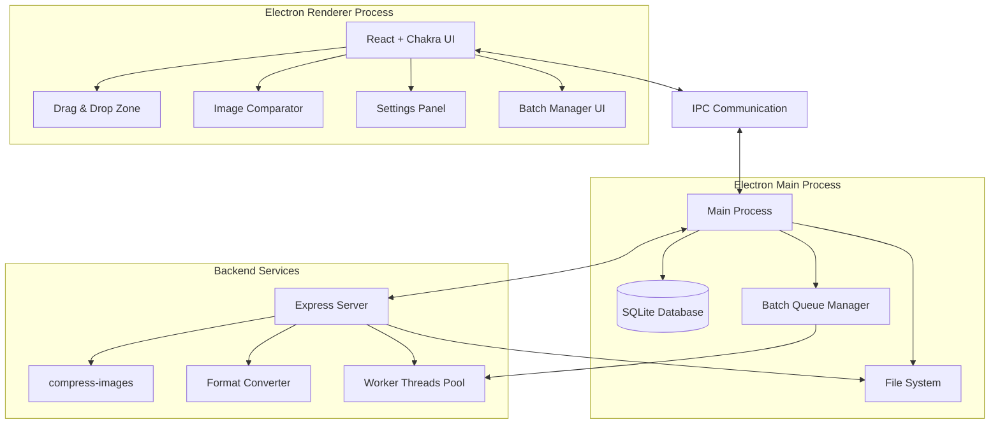
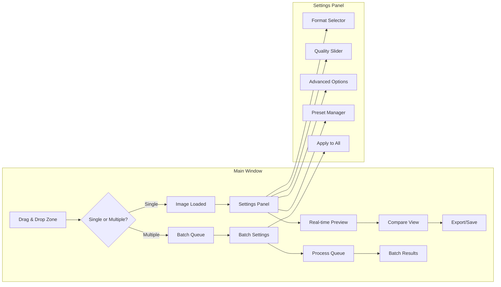

# 🏰 The Quest for Lossly: A Comprehensive Architectural Plan

## 🎯 Quest Objectives
Build a powerful, user-friendly Electron image compression application with:
- Full format support (JPEG, JPG, PNG, SVG, GIF, WEBP) with conversion capabilities
- Real-time side-by-side comparison with draggable divider
- Comprehensive settings panel with all compress-images options
- Drag-and-drop file upload with **batch processing support**
- Beautiful Chakra UI design
- SQLite for storing compression history and presets

## 🏗️ Application Architecture



## 📁 Project Structure

```
lossly/
├── package.json
├── main.js                    # Electron main process
├── preload.js                 # Preload script for IPC
├── src/
│   ├── renderer/             # Frontend React app
│   │   ├── index.html
│   │   ├── index.js
│   │   ├── App.js
│   │   ├── components/
│   │   │   ├── DragDropZone.js
│   │   │   ├── ImageComparator.js
│   │   │   ├── SettingsPanel.js
│   │   │   ├── CompressionHistory.js
│   │   │   ├── PresetManager.js
│   │   │   ├── BatchProcessor.js      # NEW: Batch processing UI
│   │   │   └── QueueManager.js        # NEW: Queue management UI
│   │   ├── hooks/
│   │   │   ├── useCompression.js
│   │   │   ├── useImagePreview.js
│   │   │   └── useBatchQueue.js       # NEW: Batch queue hook
│   │   ├── theme/
│   │   │   └── chakraTheme.js
│   │   └── utils/
│   │       ├── imageHelpers.js
│   │       └── batchHelpers.js        # NEW: Batch processing utilities
│   ├── backend/
│   │   ├── server.js         # Express server
│   │   ├── routes/
│   │   │   ├── compression.js
│   │   │   ├── conversion.js
│   │   │   └── batch.js              # NEW: Batch processing routes
│   │   ├── services/
│   │   │   ├── compressionService.js
│   │   │   ├── conversionService.js
│   │   │   ├── databaseService.js
│   │   │   └── batchQueueService.js  # NEW: Batch queue management
│   │   ├── workers/
│   │   │   └── compressionWorker.js  # NEW: Worker thread for batch
│   │   └── db/
│   │       └── schema.sql
│   └── shared/
│       └── constants.js
├── public/
│   └── icon.png
└── build/                    # Build output
```

## 🎨 UI/UX Design Flow



## 💾 Database Schema

```sql
-- Compression History
CREATE TABLE compression_history (
    id INTEGER PRIMARY KEY AUTOINCREMENT,
    batch_id TEXT,                      -- NEW: Links batch operations
    original_filename TEXT NOT NULL,
    original_size INTEGER NOT NULL,
    compressed_size INTEGER NOT NULL,
    compression_ratio REAL NOT NULL,
    settings TEXT NOT NULL, -- JSON string
    created_at TIMESTAMP DEFAULT CURRENT_TIMESTAMP
);

-- User Presets
CREATE TABLE presets (
    id INTEGER PRIMARY KEY AUTOINCREMENT,
    name TEXT NOT NULL UNIQUE,
    settings TEXT NOT NULL, -- JSON string
    description TEXT,
    created_at TIMESTAMP DEFAULT CURRENT_TIMESTAMP,
    updated_at TIMESTAMP DEFAULT CURRENT_TIMESTAMP
);

-- Recent Files
CREATE TABLE recent_files (
    id INTEGER PRIMARY KEY AUTOINCREMENT,
    filepath TEXT NOT NULL,
    last_accessed TIMESTAMP DEFAULT CURRENT_TIMESTAMP
);

-- Batch Operations (NEW)
CREATE TABLE batch_operations (
    id TEXT PRIMARY KEY,                -- UUID
    name TEXT,
    total_files INTEGER NOT NULL,
    processed_files INTEGER DEFAULT 0,
    status TEXT NOT NULL,               -- 'queued', 'processing', 'completed', 'cancelled'
    settings TEXT NOT NULL,             -- JSON string
    started_at TIMESTAMP,
    completed_at TIMESTAMP,
    created_at TIMESTAMP DEFAULT CURRENT_TIMESTAMP
);
```

## 🔧 Core Features Implementation

### 1. **Drag & Drop System**
- Accept multiple files simultaneously
- Visual feedback during drag
- File type validation
- Progress indicators for batch processing
- Folder support for recursive processing

### 2. **Image Comparator Component**
- Synchronized zoom/pan between images
- Draggable divider with smooth animation
- Pixel-level difference highlighting option
- File size and dimension displays
- Quick toggle between batch items

### 3. **Settings Panel**
All compress-images options with tooltips:
- **Quality**: 0-100 slider with live preview
- **Output Format**: Dropdown with all supported formats
- **Resize**: Width/height inputs with aspect ratio lock
- **Advanced Options**:
  - Progressive encoding (JPEG)
  - Interlaced (PNG/GIF)
  - Color depth reduction
  - Metadata stripping
  - Compression algorithm selection
- **Batch Options** (NEW):
  - Apply settings to all files
  - Per-file custom settings
  - Output directory selection
  - File naming patterns

### 4. **Real-time Preview System**
- Debounced compression on setting changes
- WebWorker for non-blocking compression
- Cached results for instant switching
- Preview quality indicator
- Batch preview grid view

### 5. **Batch Processing System** (NEW)
- **Queue Management**:
  - Add/remove files from queue
  - Reorder processing priority
  - Pause/resume/cancel operations
  - Save queue for later processing
  
- **Processing Features**:
  - Parallel processing with configurable thread count
  - Progress tracking per file and overall
  - Error handling with retry options
  - Automatic output organization
  
- **Batch UI Components**:
  - Queue visualizer with thumbnails
  - Progress bars and ETAs
  - Summary statistics
  - Export batch report

## 🚀 Technical Implementation Details

### Electron Configuration
```javascript
// Main process features
- Auto-updater integration
- Native file dialogs
- System tray support
- Window state persistence
- Deep linking for file associations
- Multi-window support for batch monitoring
```

### Express API Endpoints
```
POST /api/compress
  - Multipart file upload
  - Compression settings in body
  - Returns compressed file + metadata

POST /api/convert
  - Source file + target format
  - Optional compression settings
  - Returns converted file

POST /api/batch/create              # NEW
  - Create new batch operation
  - Returns batch ID

POST /api/batch/:id/add-files       # NEW
  - Add files to batch queue
  
POST /api/batch/:id/process         # NEW
  - Start batch processing
  
GET /api/batch/:id/status           # NEW
  - Get batch progress and status
  
DELETE /api/batch/:id               # NEW
  - Cancel batch operation

GET /api/presets
POST /api/presets
PUT /api/presets/:id
DELETE /api/presets/:id

GET /api/history
DELETE /api/history/:id
```

### Chakra UI Theme
```javascript
// VIBE-coded aesthetic
- Dark mode with vibrant accents
- Smooth animations and transitions
- Glassmorphism effects
- Custom color palette:
  - Primary: Purple gradient (#6B46C1 to #9F7AEA)
  - Accent: Cyan (#00BCD4)
  - Success: Emerald (#10B981)
  - Warning: Amber (#F59E0B)
  - Batch: Gold gradient (#F59E0B to #EAB308)
```

### Batch Processing Architecture (NEW)
```javascript
// Worker Thread Pool
- Dynamic thread allocation (CPU cores - 1)
- Memory-aware processing limits
- Graceful degradation for large files

// Queue Management
- Priority queue implementation
- Persistent queue state
- Smart retry logic with exponential backoff

// Progress Tracking
- Real-time progress via Server-Sent Events
- Granular progress reporting
- Time estimation algorithms
```

## 🛡️ Performance & Security Considerations

### Performance:
- Image processing in separate threads
- Lazy loading for large image previews
- Virtual scrolling for history lists
- Efficient caching strategy
- **Batch Optimizations** (NEW):
  - Streaming file processing
  - Memory pooling for large batches
  - Progressive loading of results
  - Smart CPU/memory balancing

### Security:
- Input validation for all file operations
- Sandboxed renderer process
- Content Security Policy
- Safe file path handling
- **Batch Security** (NEW):
  - File access permissions checking
  - Quarantine suspicious files
  - Rate limiting for API endpoints

## 📋 Development Phases

**Phase 1: Foundation (Week 1)**
- Electron app setup with React
- Basic Express server
- SQLite integration
- Chakra UI theme configuration

**Phase 2: Core Features (Week 2)**
- Drag & drop implementation
- Basic compression functionality
- Image comparator component
- Settings panel UI

**Phase 3: Batch Processing (Week 3)** (UPDATED)
- Batch queue implementation
- Worker thread pool setup
- Batch UI components
- Progress tracking system

**Phase 4: Advanced Features (Week 4)**
- Format conversion
- Real-time preview
- Preset management
- Compression history
- Batch reporting

**Phase 5: Polish & Optimization (Week 5)**
- Performance optimization
- Error handling
- Testing suite
- Documentation
- Distribution setup

## 🎯 Success Metrics
- Sub-100ms preview updates
- Support for images up to 50MB
- Process 100+ images in batch without UI freeze
- 60+ FPS UI interactions
- < 5 second startup time
- Zero data loss guarantee
- 10+ concurrent compressions without degradation

## 🎮 Batch Processing User Journey

1. **Drop Multiple Files**
   - User drops 50 vacation photos
   - Files appear in queue with thumbnails
   
2. **Configure Settings**
   - Select "Web Optimized" preset
   - Choose JPEG output at 85% quality
   - Set max dimension to 1920px
   
3. **Start Processing**
   - Click "Process All"
   - Watch real-time progress
   - Preview results as they complete
   
4. **Review & Export**
   - Compare before/after for any image
   - See total space saved
   - Export all or selected results
   - Save batch report

---

This comprehensive plan now includes robust batch processing capabilities, making Lossly a powerful tool for both single image optimization and bulk processing workflows. The architecture supports scalable, efficient batch operations while maintaining the beautiful, responsive UI experience.
