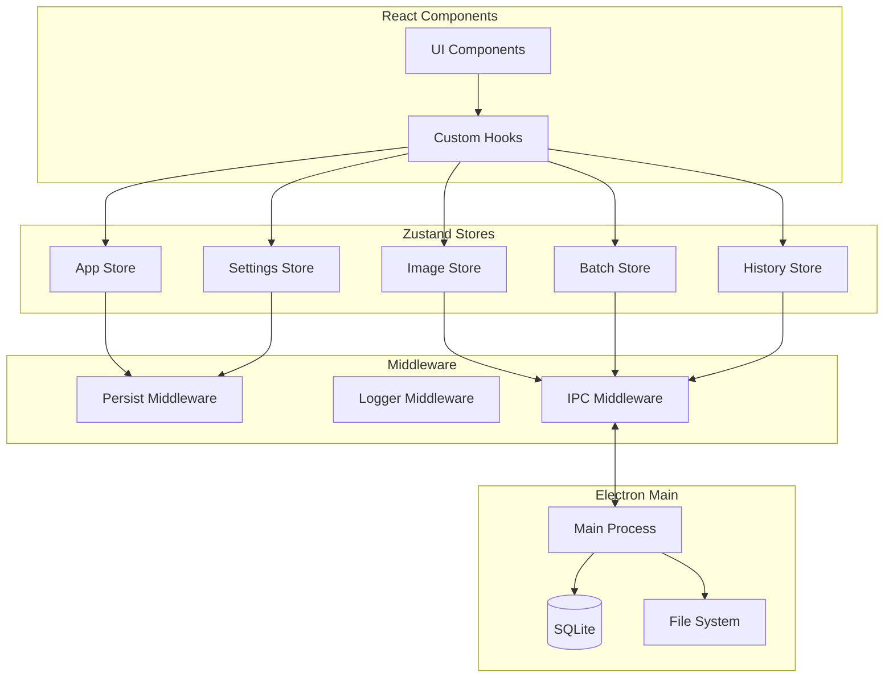

# 🔄 State Management Architecture

## 📋 Overview

This document defines the state management architecture for Lossly's React application using Zustand for its simplicity, TypeScript support, and excellent performance. The architecture ensures predictable state updates, efficient re-renders, and seamless integration with Electron's IPC.

## 🎯 State Management Principles

1. **Single Source of Truth**: Each piece of state has one authoritative source
2. **Unidirectional Data Flow**: State flows down, actions flow up
3. **Immutable Updates**: State is never mutated directly
4. **Normalized Data**: Avoid deeply nested structures
5. **Optimistic Updates**: Immediate UI feedback with rollback capability

## 🏗️ Architecture Overview



## 🗄️ Store Definitions

### 1. App Store (Global Application State)

```typescript
// src/renderer/stores/appStore.ts
import { create } from 'zustand';
import { devtools, subscribeWithSelector } from 'zustand/middleware';
import { immer } from 'zustand/middleware/immer';

interface AppState {
  // UI State
  activeView: 'drop' | 'compare' | 'batch' | 'history';
  sidebarCollapsed: boolean;
  theme: 'dark' | 'light';
  
  // Application State
  isProcessing: boolean;
  currentOperation: string | null;
  notifications: Notification[];
  
  // System State
  cpuUsage: number;
  memoryUsage: number;
  activeWorkers: number;
  
  // Actions
  setActiveView: (view: AppState['activeView']) => void;
  toggleSidebar: () => void;
  addNotification: (notification: Notification) => void;
  removeNotification: (id: string) => void;
  updateSystemStats: (stats: SystemStats) => void;
}

interface Notification {
  id: string;
  type: 'success' | 'error' | 'warning' | 'info';
  title: string;
  message?: string;
  duration?: number;
  timestamp: number;
}

export const useAppStore = create<AppState>()(
  devtools(
    subscribeWithSelector(
      immer((set) => ({
        // Initial State
        activeView: 'drop',
        sidebarCollapsed: false,
        theme: 'dark',
        isProcessing: false,
        currentOperation: null,
        notifications: [],
        cpuUsage: 0,
        memoryUsage: 0,
        activeWorkers: 0,
        
        // Actions
        setActiveView: (view) =>
          set((state) => {
            state.activeView = view;
          }),
          
        toggleSidebar: () =>
          set((state) => {
            state.sidebarCollapsed = !state.sidebarCollapsed;
          }),
          
        addNotification: (notification) =>
          set((state) => {
            state.notifications.push(notification);
            
            // Auto-remove after duration
            if (notification.duration) {
              setTimeout(() => {
                useAppStore.getState().removeNotification(notification.id);
              }, notification.duration);
            }
          }),
          
        removeNotification: (id) =>
          set((state) => {
            state.notifications = state.notifications.filter(
              (n) => n.id !== id
            );
          }),
          
        updateSystemStats: (stats) =>
          set((state) => {
            state.cpuUsage = stats.cpu;
            state.memoryUsage = stats.memory;
            state.activeWorkers = stats.workers;
          }),
      }))
    ),
    {
      name: 'app-store',
    }
  )
);

// Selectors
export const selectIsProcessing = (state: AppState) => state.isProcessing;
export const selectActiveNotifications = (state: AppState) =>
  state.notifications.filter((n) => Date.now() - n.timestamp < 10000);
```

### 2. Image Store (Current Image Operations)

```typescript
// src/renderer/stores/imageStore.ts
import { create } from 'zustand';
import { devtools } from 'zustand/middleware';
import { immer } from 'zustand/middleware/immer';

interface ImageState {
  // Current Image
  originalImage: ImageData | null;
  compressedImage: CompressedImageData | null;
  isCompressing: boolean;
  compressionProgress: number;
  
  // Comparison
  comparisonMode: 'side-by-side' | 'overlay' | 'difference';
  dividerPosition: number; // 0-100
  zoomLevel: number; // 0.1-5
  panPosition: { x: number; y: number };
  
  // Settings for current image
  currentSettings: CompressionSettings;
  estimatedSize: number | null;
  
  // Actions
  loadImage: (file: File) => Promise<void>;
  updateSettings: (settings: Partial<CompressionSettings>) => void;
  startCompression: () => Promise<void>;
  cancelCompression: () => void;
  setDividerPosition: (position: number) => void;
  setZoomLevel: (zoom: number) => void;
  setPanPosition: (position: { x: number; y: number }) => void;
  clearImages: () => void;
}

interface ImageData {
  id: string;
  name: string;
  path: string;
  size: number;
  dimensions: { width: number; height: number };
  format: string;
  dataUrl?: string; // For preview
  metadata?: Record<string, any>;
}

interface CompressedImageData extends ImageData {
  compressionRatio: number;
  settings: CompressionSettings;
  processingTime: number;
}

interface CompressionSettings {
  format: 'jpeg' | 'jpg' | 'png' | 'webp' | 'gif';
  quality: number;
  resize?: {
    width?: number;
    height?: number;
    maintainAspectRatio: boolean;
  };
  advanced: {
    progressive?: boolean;
    interlaced?: boolean;
    optimizationLevel?: number;
    colors?: number;
    stripMetadata?: boolean;
  };
}

export const useImageStore = create<ImageState>()(
  devtools(
    immer((set, get) => ({
      // Initial State
      originalImage: null,
      compressedImage: null,
      isCompressing: false,
      compressionProgress: 0,
      comparisonMode: 'side-by-side',
      dividerPosition: 50,
      zoomLevel: 1,
      panPosition: { x: 0, y: 0 },
      currentSettings: {
        format: 'jpeg',
        quality: 85,
        advanced: {
          stripMetadata: true,
        },
      },
      estimatedSize: null,
      
      // Actions
      loadImage: async (file) => {
        const imageData = await processImageFile(file);
        
        set((state) => {
          state.originalImage = imageData;
          state.compressedImage = null;
          state.compressionProgress = 0;
          
          // Auto-detect format
          const format = imageData.format.toLowerCase();
          if (['jpeg', 'jpg', 'png', 'webp', 'gif'].includes(format)) {
            state.currentSettings.format = format as any;
          }
        });
        
        // Request size estimation
        window.electron.estimateCompressedSize(
          imageData.path,
          get().currentSettings
        );
      },
      
      updateSettings: (settings) => {
        set((state) => {
          Object.assign(state.currentSettings, settings);
        });
        
        // Debounced size estimation
        debouncedEstimate(get().originalImage?.path, get().currentSettings);
      },
      
      startCompression: async () => {
        const { originalImage, currentSettings } = get();
        if (!originalImage) return;
        
        set((state) => {
          state.isCompressing = true;
          state.compressionProgress = 0;
        });
        
        try {
          const result = await window.electron.compressImage(
            originalImage.path,
            currentSettings,
            (progress) => {
              set((state) => {
                state.compressionProgress = progress;
              });
            }
          );
          
          set((state) => {
            state.compressedImage = result;
            state.isCompressing = false;
            state.compressionProgress = 100;
          });
        } catch (error) {
          set((state) => {
            state.isCompressing = false;
            state.compressionProgress = 0;
          });
          throw error;
        }
      },
      
      cancelCompression: () => {
        window.electron.cancelCompression();
        set((state) => {
          state.isCompressing = false;
          state.compressionProgress = 0;
        });
      },
      
      setDividerPosition: (position) =>
        set((state) => {
          state.dividerPosition = Math.max(0, Math.min(100, position));
        }),
        
      setZoomLevel: (zoom) =>
        set((state) => {
          state.zoomLevel = Math.max(0.1, Math.min(5, zoom));
        }),
        
      setPanPosition: (position) =>
        set((state) => {
          state.panPosition = position;
        }),
        
      clearImages: () =>
        set((state) => {
          state.originalImage = null;
          state.compressedImage = null;
          state.compressionProgress = 0;
          state.estimatedSize = null;
        }),
    })),
    {
      name: 'image-store',
    }
  )
);
```

### 3. Batch Store (Batch Processing State)

```typescript
// src/renderer/stores/batchStore.ts
import { create } from 'zustand';
import { temporal } from 'zundo';
import type { TemporalState } from 'zundo';

interface BatchState {
  // Batch Queue
  queue: QueueItem[];
  currentBatchId: string | null;
  batchSettings: BatchSettings;
  
  // Processing State
  isProcessing: boolean;
  processedCount: number;
  totalCount: number;
  currentFile: string | null;
  errors: BatchError[];
  
  // Stats
  totalOriginalSize: number;
  totalCompressedSize: number;
  averageCompressionRatio: number;
  estimatedTimeRemaining: number;
  
  // Actions
  addToQueue: (files: File[]) => void;
  removeFromQueue: (ids: string[]) => void;
  reorderQueue: (fromIndex: number, toIndex: number) => void;
  updateBatchSettings: (settings: Partial<BatchSettings>) => void;
  startBatchProcessing: () => Promise<void>;
  pauseBatchProcessing: () => void;
  resumeBatchProcessing: () => void;
  cancelBatchProcessing: () => void;
  clearQueue: () => void;
  retryFailed: () => void;
}

interface QueueItem {
  id: string;
  file: File;
  status: 'pending' | 'processing' | 'completed' | 'failed';
  progress: number;
  result?: CompressionResult;
  error?: string;
  selected: boolean;
}

interface BatchSettings {
  outputFormat: 'original' | 'jpeg' | 'png' | 'webp';
  quality: number;
  resize?: {
    maxWidth?: number;
    maxHeight?: number;
  };
  outputDirectory: string;
  namingPattern: string;
  overwriteExisting: boolean;
  createTimestampFolder: boolean;
  concurrency: number;
}

export const useBatchStore = create<BatchState>()(
  temporal(
    (set, get) => ({
      // Initial State
      queue: [],
      currentBatchId: null,
      batchSettings: {
        outputFormat: 'original',
        quality: 85,
        outputDirectory: './compressed',
        namingPattern: '{name}_compressed',
        overwriteExisting: false,
        createTimestampFolder: true,
        concurrency: 4,
      },
      isProcessing: false,
      processedCount: 0,
      totalCount: 0,
      currentFile: null,
      errors: [],
      totalOriginalSize: 0,
      totalCompressedSize: 0,
      averageCompressionRatio: 0,
      estimatedTimeRemaining: 0,
      
      // Actions
      addToQueue: (files) => {
        const newItems = files.map((file) => ({
          id: generateId(),
          file,
          status: 'pending' as const,
          progress: 0,
          selected: true,
        }));
        
        set((state) => ({
          queue: [...state.queue, ...newItems],
          totalCount: state.queue.length + newItems.length,
        }));
      },
      
      removeFromQueue: (ids) => {
        set((state) => ({
          queue: state.queue.filter((item) => !ids.includes(item.id)),
          totalCount: state.queue.filter((item) => !ids.includes(item.id)).length,
        }));
      },
      
      reorderQueue: (fromIndex, toIndex) => {
        set((state) => {
          const newQueue = [...state.queue];
          const [removed] = newQueue.splice(fromIndex, 1);
          newQueue.splice(toIndex, 0, removed);
          return { queue: newQueue };
        });
      },
      
      updateBatchSettings: (settings) => {
        set((state) => ({
          batchSettings: { ...state.batchSettings, ...settings },
        }));
      },
      
      startBatchProcessing: async () => {
        const { queue, batchSettings } = get();
        const selectedItems = queue.filter((item) => item.selected);
        
        if (selectedItems.length === 0) return;
        
        set({
          isProcessing: true,
          processedCount: 0,
          totalCount: selectedItems.length,
          errors: [],
        });
        
        const batchId = await window.electron.createBatch({
          settings: batchSettings,
          files: selectedItems.map((item) => item.file.path),
        });
        
        set({ currentBatchId: batchId });
        
        // Listen for progress updates
        window.electron.onBatchProgress(batchId, (progress) => {
          set((state) => ({
            processedCount: progress.processed,
            currentFile: progress.currentFile,
            estimatedTimeRemaining: progress.estimatedTime,
            queue: state.queue.map((item) =>
              item.file.name === progress.currentFile
                ? { ...item, status: 'processing', progress: progress.fileProgress }
                : item
            ),
          }));
        });
        
        // Listen for file completion
        window.electron.onFileComplete(batchId, (result) => {
          set((state) => ({
            queue: state.queue.map((item) =>
              item.file.name === result.filename
                ? {
                    ...item,
                    status: result.success ? 'completed' : 'failed',
                    progress: 100,
                    result: result.success ? result.data : undefined,
                    error: result.error,
                  }
                : item
            ),
            totalOriginalSize: state.totalOriginalSize + (result.data?.originalSize || 0),
            totalCompressedSize: state.totalCompressedSize + (result.data?.compressedSize || 0),
            errors: result.success
              ? state.errors
              : [...state.errors, { file: result.filename, error: result.error }],
          }));
        });
        
        // Listen for batch completion
        window.electron.onBatchComplete(batchId, (summary) => {
          set({
            isProcessing: false,
            averageCompressionRatio: summary.averageRatio,
          });
        });
      },
      
      pauseBatchProcessing: () => {
        const { currentBatchId } = get();
        if (currentBatchId) {
          window.electron.pauseBatch(currentBatchId);
          set({ isProcessing: false });
        }
      },
      
      resumeBatchProcessing: () => {
        const { currentBatchId } = get();
        if (currentBatchId) {
          window.electron.resumeBatch(currentBatchId);
          set({ isProcessing: true });
        }
      },
      
      cancelBatchProcessing: () => {
        const { currentBatchId } = get();
        if (currentBatchId) {
          window.electron.cancelBatch(currentBatchId);
          set({
            isProcessing: false,
            currentBatchId: null,
            queue: get().queue.map((item) =>
              item.status === 'processing'
                ? { ...item, status: 'pending', progress: 0 }
                : item
            ),
          });
        }
      },
      
      clearQueue: () => {
        set({
          queue: [],
          totalCount: 0,
          processedCount: 0,
          errors: [],
          totalOriginalSize: 0,
          totalCompressedSize: 0,
        });
      },
      
      retryFailed: () => {
        set((state) => ({
          queue: state.queue.map((item) =>
            item.status === 'failed'
              ? { ...item, status: 'pending', progress: 0, error: undefined }
              : item
          ),
          errors: [],
        }));
      },
    }),
    {
      limit: 50, // Undo/redo history limit
    }
  )
);

// Undo/Redo hooks
export const useBatchHistory = () => {
  const store = useBatchStore as TemporalState<BatchState>;
  return {
    undo: store.temporal.getState().undo,
    redo: store.temporal.getState().redo,
    canUndo: store.temporal.getState().canUndo,
    canRedo: store.temporal.getState().canRedo,
  };
};
```

### 4. Settings Store (User Preferences)

```typescript
// src/renderer/stores/settingsStore.ts
import { create } from 'zustand';
import { persist } from 'zustand/middleware';

interface SettingsState {
  // Compression Defaults
  defaultQuality: number;
  defaultFormat: string;
  autoOptimize: boolean;
  preserveMetadata: boolean;
  
  // UI Preferences
  theme: 'dark' | 'light' | 'system';
  compactMode: boolean;
  showThumbnails: boolean;
  animationsEnabled: boolean;
  
  // Batch Defaults
  defaultConcurrency: number;
  defaultOutputPattern: string;
  autoStartBatch: boolean;
  
  // System
  hardwareAcceleration: boolean;
  autoUpdate: boolean;
  telemetry: boolean;
  
  // Shortcuts
  shortcuts: Record<string, string>;
  
  // Actions
  updateSettings: (settings: Partial<SettingsState>) => void;
  resetToDefaults: () => void;
  importSettings: (settings: string) => void;
  exportSettings: () => string;
}

const defaultSettings: Omit<SettingsState, 'updateSettings' | 'resetToDefaults' | 'importSettings' | 'exportSettings'> = {
  defaultQuality: 85,
  defaultFormat: 'original',
  autoOptimize: true,
  preserveMetadata: false,
  theme: 'dark',
  compactMode: false,
  showThumbnails: true,
  animationsEnabled: true,
  defaultConcurrency: 4,
  defaultOutputPattern: '{name}_compressed',
  autoStartBatch: false,
  hardwareAcceleration: true,
  autoUpdate: true,
  telemetry: false,
  shortcuts: {
    'open': 'Ctrl+O',
    'save': 'Ctrl+S',
    'compress': 'Ctrl+Enter',
    'compare': 'Ctrl+Shift+C',
    'batch': 'Ctrl+B',
    'settings': 'Ctrl+,',
  },
};

export const useSettingsStore = create<SettingsState>()(
  persist(
    (set, get) => ({
      ...defaultSettings,
      
      updateSettings: (settings) => {
        set((state) => ({ ...state, ...settings }));
        
        // Apply theme change
        if (settings.theme) {
          window.electron.setTheme(settings.theme);
        }
        
        // Apply hardware acceleration
        if (settings.hardwareAcceleration !== undefined) {
          window.electron.setHardwareAcceleration(settings.hardwareAcceleration);
        }
      },
      
      resetToDefaults: () => {
        set(defaultSettings);
      },
      
      importSettings: (settingsJson) => {
        try {
          const imported = JSON.parse(settingsJson);
          set((state) => ({ ...state, ...imported }));
        } catch (error) {
          throw new Error('Invalid settings format');
        }
      },
      
      exportSettings: () => {
        const state = get();
        const exportable = { ...state };
        delete exportable.updateSettings;
        delete exportable.resetToDefaults;
        delete exportable.importSettings;
        delete exportable.exportSettings;
        return JSON.stringify(exportable, null, 2);
      },
    }),
    {
      name: 'settings-storage',
      version: 1,
      migrate: (persistedState: any, version: number) => {
        // Handle settings migration between versions
        if (version === 0) {
          // Migration from version 0 to 1
          return { ...defaultSettings, ...persistedState };
        }
        return persistedState;
      },
    }
  )
);
```

### 5. History Store (Compression History)

```typescript
// src/renderer/stores/historyStore.ts
import { create } from 'zustand';
import { devtools } from 'zustand/middleware';

interface HistoryState {
  items: HistoryItem[];
  filter: HistoryFilter;
  sortBy: 'date' | 'size' | 'ratio';
  sortOrder: 'asc' | 'desc';
  
  // Actions
  loadHistory: (limit?: number) => Promise<void>;
  addHistoryItem: (item: HistoryItem) => void;
  deleteHistoryItem: (id: string) => Promise<void>;
  clearHistory: () => Promise<void>;
  setFilter: (filter: Partial<HistoryFilter>) => void;
  setSorting: (sortBy: HistoryState['sortBy'], order?: HistoryState['sortOrder']) => void;
}

interface HistoryItem {
  id: string;
  filename: string;
  originalSize: number;
  compressedSize: number;
  compressionRatio: number;
  settings: CompressionSettings;
  timestamp: number;
  batchId?: string;
}

interface HistoryFilter {
  search: string;
  dateFrom?: number;
  dateTo?: number;
  minRatio?: number;
  format?: string;
}

export const useHistoryStore = create<HistoryState>()(
  devtools(
    (set, get) => ({
      items: [],
      filter: {
        search: '',
      },
      sortBy: 'date',
      sortOrder: 'desc',
      
      loadHistory: async (limit = 100) => {
        const history = await window.electron.getCompressionHistory(limit);
        set({ items: history });
      },
      
      addHistoryItem: (item) => {
        set((state) => ({
          items: [item, ...state.items],
        }));
      },
      
      deleteHistoryItem: async (id) => {
        await window.electron.deleteHistoryItem(id);
        set((state) => ({
          items: state.items.filter((item) => item.id !== id),
        }));
      },
      
      clearHistory: async () => {
        await window.electron.clearHistory();
        set({ items: [] });
      },
      
      setFilter: (filter) => {
        set((state) => ({
          filter: { ...state.filter, ...filter },
        }));
      },
      
      setSorting: (sortBy, order) => {
        set((state) => ({
          sortBy,
          sortOrder: order || (state.sortBy === sortBy && state.sortOrder === 'asc' ? 'desc' : 'asc'),
        }));
      },
    }),
    {
      name: 'history-store',
    }
  )
);

// Computed selectors
export const selectFilteredHistory = (state: HistoryState) => {
  let filtered = [...state.items];
  
  // Apply filters
  if (state.filter.search) {
    const search = state.filter.search.toLowerCase();
    filtered = filtered.filter((item) =>
      item.filename.toLowerCase().includes(search)
    );
  }
  
  if (state.filter.dateFrom) {
    filtered = filtered.filter((item) => item.timestamp >= state.filter.dateFrom!);
  }
  
  if (state.filter.dateTo) {
    filtered = filtered.filter((item) => item.timestamp <= state.filter.dateTo!);
  }
  
  if (state.filter.minRatio) {
    filtered = filtered.filter((item) => item.compressionRatio >= state.filter.minRatio!);
  }
  
  if (state.filter.format) {
    filtered = filtered.filter((item) => item.settings.format === state.filter.format);
  }
  
  // Apply sorting
  filtered.sort((a, b) => {
    let comparison = 0;
    
    switch (state.sortBy) {
      case 'date':
        comparison = a.timestamp - b.timestamp;
        break;
      case 'size':
        comparison = a.originalSize - b.originalSize;
        break;
      case 'ratio':
        comparison = a.compressionRatio - b.compressionRatio;
        break;
    }
    
    return state.sortOrder === 'asc' ? comparison : -comparison;
  });
  
  return filtered;
};
```

## 🔗 IPC Bridge

```typescript
// src/preload/index.ts
import { contextBridge, ipcRenderer } from 'electron';

// Type-safe IPC bridge
contextBridge.exposeInMainWorld('electron', {
  // Image operations
  compressImage: (path: string, settings: CompressionSettings, onProgress?: (progress: number) => void) => {
    const channel = `compress-${Date.now()}`;
    
    if (onProgress) {
      ipcRenderer.on(`${channel}-progress`, (_, progress) => onProgress(progress));
    }
    
    return ipcRenderer.invoke('compress-image', { path, settings, channel });
  },
  
  cancelCompression: () => ipcRenderer.send('cancel-compression'),
  
  estimateCompressedSize: (path: string, settings: CompressionSettings) =>
    ipcRenderer.invoke('estimate-size', { path, settings }),
  
  // Batch operations
  createBatch: (options: BatchOptions) =>
    ipcRenderer.invoke('create-batch', options),
  
  onBatchProgress: (batchId: string, callback: (progress: BatchProgress) => void) => {
    ipcRenderer.on(`batch-progress-${batchId}`, (_, progress) => callback(progress));
  },
  
  onFileComplete: (batchId: string, callback: (result: FileResult) => void) => {
    ipcRenderer.on(`file-complete-${batchId}`, (_, result) => callback(result));
  },
  
  onBatchComplete: (batchId: string, callback: (summary: BatchSummary) => void) => {
    ipcRenderer.once(`batch-complete-${batchId}`, (_, summary) => callback(summary));
  },
  
  // History
  getCompressionHistory: (limit: number) =>
    ipcRenderer.invoke('get-history', limit),
  
  deleteHistoryItem: (id: string) =>
    ipcRenderer.invoke('delete-history-item', id),
  
  clearHistory: () =>
    ipcRenderer.invoke('clear-history'),
  
  // Settings
  setTheme: (theme: string) =>
    ipcRenderer.send('set-theme', theme),
  
  setHardwareAcceleration: (enabled: boolean) =>
    ipcRenderer.send('set-hardware-acceleration', enabled),
});
```

## 🎣 Custom Hooks

```typescript
// src/renderer/hooks/useCompression.ts
export function useCompression() {
  const { 
    originalImage,
    currentSettings,
    isCompressing,
    startCompression,
    cancelCompression 
  } = useImageStore();
  
  const { addNotification } = useAppStore();
  const { addHistoryItem } = useHistoryStore();
  
  const compress = useCallback(async () => {
    if (!originalImage) {
      addNotification({
        id: generateId(),
        type: 'error',
        title: 'No image loaded',
        duration: 3000,
        timestamp: Date.now(),
      });
      return;
    }
    
    try {
      const result = await startCompression();
      
      // Add to history
      addHistoryItem({
        id: generateId(),
        filename: originalImage.name,
        originalSize: originalImage.size,
        compressedSize: result.size,
        compressionRatio: result.compressionRatio,
        settings: currentSettings,
        timestamp: Date.now(),
      });
      
      addNotification({
        id: generateId(),
        type: 'success',
        title: 'Compression complete',
        message: `Reduced size by ${Math.round((1 - result.compressionRatio) * 100)}%`,
        duration: 5000,
        timestamp: Date.now(),
      });
    } catch (error) {
      addNotification({
        id: generateId(),
        type: 'error',
        title: 'Compression failed',
        message: error.message,
        duration: 5000,
        timestamp: Date.now(),
      });
    }
  }, [originalImage, currentSettings, startCompression, addHistoryItem, addNotification]);
  
  return {
    compress,
    cancel: cancelCompression,
    isCompressing,
    canCompress: !!originalImage && !isCompressing,
  };
}

// src/renderer/hooks/useDragAndDrop.ts
export function useDragAndDrop(onDrop: (files: File[]) => void) {
  const [isDragging, setIsDragging] = useState(false);
  const dragCounter = useRef(0);
  
  const handleDragEnter = useCallback((e: DragEvent) => {
    e.preventDefault();
    dragCounter.current++;
    
    if (e.dataTransfer?.items && e.dataTransfer.items.length > 0) {
      setIsDragging(true);
    }
  }, []);
  
  const handleDragLeave = useCallback((e: DragEvent) => {
    e.preventDefault();
    dragCounter.current--;
    
    if (dragCounter.current === 0) {
      setIsDragging(false);
    }
  }, []);
  
  const handleDragOver = useCallback((e: DragEvent) => {
    e.preventDefault();
  }, []);
  
  const handleDrop = useCallback((e: DragEvent) => {
    e.preventDefault();
    setIsDragging(false);
    dragCounter.current = 0;
    
    const files: File[] = [];
    
    if (e.dataTransfer?.files) {
      for (let i = 0; i < e.dataTransfer.files.length; i++) {
        const file = e.dataTransfer.files[i];
        if (isImageFile(file)) {
          files.push(file);
        }
      }
    }
    
    if (files.length > 0) {
      onDrop(files);
    }
  }, [onDrop]);
  
  return {
    isDragging,
    dragHandlers: {
      onDragEnter: handleDragEnter,
      onDragLeave: handleDragLeave,
      onDragOver: handleDragOver,
      onDrop: handleDrop,
    },
  };
}
```

## 🔄 Real-time Sync

```typescript
// src/renderer/services/realtimeSync.ts
class RealtimeSync {
  private subscribers = new Map<string, Set<(data: any) => void>>();
  
  constructor() {
    this.setupIPCListeners();
  }
  
  private setupIPCListeners() {
    // Listen for store updates from main process
    window.electron.onStoreUpdate((update: StoreUpdate) => {
      const subscribers = this.subscribers.get(update.store);
      if (subscribers) {
        subscribers.forEach((callback) => callback(update.data));
      }
    });
  }
  
  subscribe(store: string, callback: (data: any) => void) {
    if (!this.subscribers.has(store)) {
      this.subscribers.set(store, new Set());
    }
    
    this.subscribers.get(store)!.add(callback);
    
    // Return unsubscribe function
    return () => {
      this.subscribers.get(store)?.delete(callback);
    };
  }
}

// Auto-sync specific stores with main process
export function setupStoreSync() {
  const sync = new RealtimeSync();
  
  // Sync system stats
  sync.subscribe('system', (stats) => {
    useAppStore.getState().updateSystemStats(stats);
  });
  
  // Sync batch progress from background workers
  sync.subscribe('batch', (progress) => {
    useBatchStore.getState().updateProgress(progress);
  });
}
```

## 🎨 React Integration Example

```typescript
// src/renderer/components/CompressionPanel.tsx
import React from 'react';
import { Box, VStack, HStack, Slider, Select, Button } from '@chakra-ui/react';
import { useImageStore } from '../stores/imageStore';
import { useCompression } from '../hooks/useCompression';
import { shallow } from 'zustand/shallow';

export function CompressionPanel() {
  // Optimized selectors to prevent unnecessary re-renders
  const settings = useImageStore((state) => state.currentSettings);
  const updateSettings = useImageStore((state) => state.updateSettings);
  const estimatedSize = useImageStore((state) => state.estimatedSize);
  
  const { compress, cancel, isCompressing, canCompress } = useCompression();
  
  return (
    <VStack spacing={4} align="stretch">
      <Box>
        <Text>Format</Text>
        <Select
          value={settings.format}
          onChange={(e) => updateSettings({ format: e.target.value })}
          isDisabled={isCompressing}
        >
          <option value="jpeg">JPEG</option>
          <option value="png">PNG</option>
          <option value="webp">WebP</option>
        </Select>
      </Box>
      
      <Box>
        <Text>Quality: {settings.quality}%</Text>
        <Slider
          value={settings.quality}
          onChange={(value) => updateSettings({ quality: value })}
          min={0}
          max={100}
          isDisabled={isCompressing}
        />
      </Box>
      
      {estimatedSize && (
        <Text fontSize="sm" color="gray.500">
          Estimated size: {formatBytes(estimatedSize)}
        </Text>
      )}
      
      <HStack>
        <Button
          colorScheme="purple"
          onClick={compress}
          isLoading={isCompressing}
          isDisabled={!canCompress}
        >
          Compress
        </Button>
        
        {isCompressing && (
          <Button variant="ghost" onClick={cancel}>
            Cancel
          </Button>
        )}
      </HStack>
    </VStack>
  );
}
```

---

This state management architecture provides a robust, type-safe, and performant foundation for the Lossly application, with clear separation of concerns and excellent developer experience.
