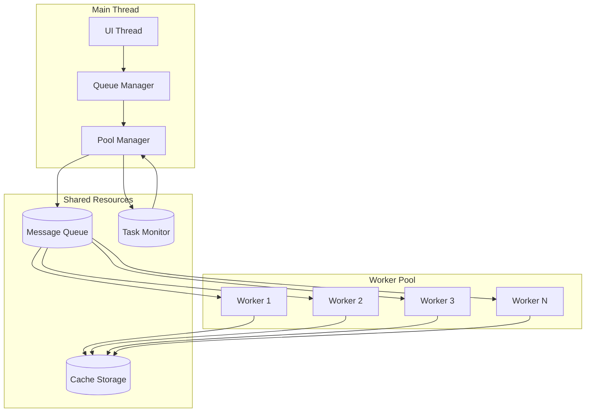

# ⚡ Image Compression Worker Thread System - Technical Specification

## 🎯 Overview

The worker thread system enables parallel image compression processing to maximize CPU utilization and maintain UI responsiveness. This document details the architecture, implementation, and optimization strategies for the multi-threaded compression engine.

## 🏗️ Architecture



## 📋 Core Components

### 1. Worker Pool Manager

```typescript
interface WorkerPoolConfig {
  minWorkers: number;          // Minimum workers (default: 1)
  maxWorkers: number;          // Maximum workers (default: CPU cores - 1)
  idleTimeout: number;         // MS before idle worker termination
  taskTimeout: number;         // MS before task considered failed
  memoryLimit: number;         // MB per worker memory limit
  cpuThreshold: number;        // CPU % to trigger scaling
}

class WorkerPoolManager {
  private workers: Map<string, WorkerThread>;
  private taskQueue: PriorityQueue<CompressionTask>;
  private activeTasksMap: Map<string, TaskMetadata>;
  
  constructor(config: WorkerPoolConfig) {
    this.initializeWorkers(config.minWorkers);
    this.setupAutoScaling();
    this.monitorHealth();
  }
  
  // Dynamic scaling based on queue size and system resources
  private autoScale(): void {
    const queueSize = this.taskQueue.size();
    const cpuUsage = process.cpuUsage();
    const memoryUsage = process.memoryUsage();
    
    if (this.shouldScaleUp(queueSize, cpuUsage)) {
      this.addWorker();
    } else if (this.shouldScaleDown(queueSize, cpuUsage)) {
      this.removeWorker();
    }
  }
}
```

### 2. Worker Thread Implementation

```typescript
// compressionWorker.js - Runs in separate thread
const { parentPort, workerData } = require('worker_threads');
const compressImages = require('compress-images');
const sharp = require('sharp'); // For advanced operations

// Worker state management
const workerState = {
  id: workerData.workerId,
  tasksProcessed: 0,
  currentTask: null,
  memoryUsage: 0
};

// Message handlers
parentPort.on('message', async (message) => {
  switch (message.type) {
    case 'COMPRESS_IMAGE':
      await processCompressionTask(message.task);
      break;
    case 'HEALTH_CHECK':
      reportHealth();
      break;
    case 'TERMINATE':
      cleanup();
      process.exit(0);
  }
});

async function processCompressionTask(task: CompressionTask) {
  try {
    workerState.currentTask = task;
    
    // Pre-processing validation
    const validation = await validateImage(task.inputPath);
    if (!validation.isValid) {
      throw new Error(validation.error);
    }
    
    // Apply compression based on format
    const result = await compressImage(task);
    
    // Post-processing optimization
    if (task.settings.postProcess) {
      await postProcessImage(result.outputPath, task.settings);
    }
    
    // Report success
    parentPort.postMessage({
      type: 'TASK_COMPLETE',
      taskId: task.id,
      result: {
        originalSize: validation.size,
        compressedSize: result.size,
        compressionRatio: result.size / validation.size,
        processingTime: Date.now() - task.startTime,
        outputPath: result.outputPath
      }
    });
    
  } catch (error) {
    parentPort.postMessage({
      type: 'TASK_ERROR',
      taskId: task.id,
      error: {
        message: error.message,
        stack: error.stack,
        recoverable: isRecoverableError(error)
      }
    });
  } finally {
    workerState.currentTask = null;
    workerState.tasksProcessed++;
  }
}
```

### 3. Task Queue System

```typescript
interface CompressionTask {
  id: string;
  inputPath: string;
  outputPath: string;
  settings: CompressionSettings;
  priority: TaskPriority;
  retryCount: number;
  maxRetries: number;
  batchId?: string;
  metadata: {
    originalName: string;
    createdAt: number;
    startTime?: number;
    endTime?: number;
  };
}

enum TaskPriority {
  LOW = 0,
  NORMAL = 1,
  HIGH = 2,
  CRITICAL = 3
}

class TaskQueue {
  private heap: MinHeap<CompressionTask>;
  private taskMap: Map<string, CompressionTask>;
  private batchTracking: Map<string, Set<string>>;
  
  enqueue(task: CompressionTask): void {
    // Priority calculation based on multiple factors
    const effectivePriority = this.calculatePriority(task);
    task.priority = effectivePriority;
    
    this.heap.insert(task);
    this.taskMap.set(task.id, task);
    
    if (task.batchId) {
      this.trackBatchTask(task.batchId, task.id);
    }
  }
  
  private calculatePriority(task: CompressionTask): number {
    let priority = task.priority;
    
    // Boost priority for:
    // - Smaller files (process quickly)
    // - Retry attempts (avoid blocking)
    // - Older tasks (prevent starvation)
    
    const fileSize = getFileSize(task.inputPath);
    if (fileSize < 1_000_000) priority += 0.5; // < 1MB
    
    const age = Date.now() - task.metadata.createdAt;
    if (age > 30_000) priority += 0.3; // > 30 seconds
    
    if (task.retryCount > 0) priority += 0.2 * task.retryCount;
    
    return priority;
  }
}
```

### 4. Memory Management

```typescript
class MemoryManager {
  private memoryLimit: number;
  private currentUsage: number;
  private taskMemoryMap: Map<string, number>;
  
  async canProcessTask(task: CompressionTask): Promise<boolean> {
    const estimatedMemory = await this.estimateMemoryUsage(task);
    
    if (this.currentUsage + estimatedMemory > this.memoryLimit) {
      // Try garbage collection
      if (global.gc) global.gc();
      
      // Re-check after GC
      return this.currentUsage + estimatedMemory <= this.memoryLimit;
    }
    
    return true;
  }
  
  private async estimateMemoryUsage(task: CompressionTask): Promise<number> {
    const fileStats = await fs.stat(task.inputPath);
    const fileSize = fileStats.size;
    
    // Estimation based on format and operations
    let multiplier = 1;
    
    switch (task.settings.format) {
      case 'png':
        multiplier = 3; // Uncompressed bitmap
        break;
      case 'jpeg':
      case 'jpg':
        multiplier = 2; // DCT coefficients
        break;
      case 'webp':
        multiplier = 2.5;
        break;
      case 'gif':
        multiplier = 4; // Frame buffers
        break;
    }
    
    if (task.settings.resize) {
      multiplier *= 1.5; // Additional buffer for resizing
    }
    
    return fileSize * multiplier;
  }
}
```

## 🔄 Communication Protocol

### Message Types

```typescript
// Main Thread → Worker
interface MainToWorkerMessage {
  type: 'COMPRESS_IMAGE' | 'HEALTH_CHECK' | 'TERMINATE' | 'UPDATE_CONFIG';
  task?: CompressionTask;
  config?: Partial<WorkerConfig>;
}

// Worker → Main Thread
interface WorkerToMainMessage {
  type: 'TASK_COMPLETE' | 'TASK_ERROR' | 'TASK_PROGRESS' | 
        'HEALTH_REPORT' | 'MEMORY_WARNING' | 'READY';
  taskId?: string;
  result?: TaskResult;
  error?: TaskError;
  progress?: ProgressUpdate;
  health?: HealthReport;
}

// Progress updates for large files
interface ProgressUpdate {
  taskId: string;
  stage: 'reading' | 'processing' | 'writing' | 'optimizing';
  percentage: number;
  currentOperation: string;
}
```

### Error Handling & Recovery

```typescript
class ErrorHandler {
  private errorCounts: Map<string, number>;
  private blacklistedFiles: Set<string>;
  
  async handleTaskError(task: CompressionTask, error: TaskError): Promise<void> {
    // Log error with context
    logger.error('Task failed', {
      taskId: task.id,
      file: task.inputPath,
      error: error.message,
      stack: error.stack
    });
    
    // Determine if retry is appropriate
    if (this.shouldRetry(task, error)) {
      task.retryCount++;
      
      // Exponential backoff
      const delay = Math.min(1000 * Math.pow(2, task.retryCount), 30000);
      
      setTimeout(() => {
        this.requeueTask(task);
      }, delay);
      
    } else {
      // Mark as permanently failed
      this.blacklistedFiles.add(task.inputPath);
      
      // Notify batch manager if part of batch
      if (task.batchId) {
        this.notifyBatchFailure(task.batchId, task.id, error);
      }
    }
  }
  
  private shouldRetry(task: CompressionTask, error: TaskError): boolean {
    // Don't retry if max retries exceeded
    if (task.retryCount >= task.maxRetries) return false;
    
    // Check if error is recoverable
    const recoverableErrors = [
      'ENOENT', // File temporarily locked
      'EMFILE', // Too many open files
      'ENOMEM', // Temporary memory issue
      'ETIMEDOUT' // Network timeout for cloud storage
    ];
    
    return error.recoverable || recoverableErrors.includes(error.code);
  }
}
```

## 🚀 Performance Optimizations

### 1. Intelligent Caching

```typescript
class CompressionCache {
  private cache: LRUCache<string, CachedResult>;
  private cacheDir: string;
  
  constructor() {
    this.cache = new LRUCache({
      max: 500, // Maximum entries
      maxSize: 1024 * 1024 * 1024, // 1GB
      sizeCalculation: (value) => value.size,
      dispose: (value, key) => {
        // Clean up cached file
        fs.unlink(value.path).catch(() => {});
      }
    });
  }
  
  async get(task: CompressionTask): Promise<CachedResult | null> {
    const key = this.generateCacheKey(task);
    const cached = this.cache.get(key);
    
    if (cached && await this.isValid(cached)) {
      return cached;
    }
    
    return null;
  }
  
  private generateCacheKey(task: CompressionTask): string {
    // Create deterministic key from task parameters
    const params = {
      input: task.inputPath,
      settings: task.settings,
      mtime: fs.statSync(task.inputPath).mtime
    };
    
    return crypto
      .createHash('sha256')
      .update(JSON.stringify(params))
      .digest('hex');
  }
}
```

### 2. Batch Optimization

```typescript
class BatchOptimizer {
  // Group similar tasks for better CPU cache utilization
  optimizeBatch(tasks: CompressionTask[]): CompressionTask[] {
    return tasks
      .sort((a, b) => {
        // Group by format
        if (a.settings.format !== b.settings.format) {
          return a.settings.format.localeCompare(b.settings.format);
        }
        
        // Then by similar settings
        const aSettings = JSON.stringify(a.settings);
        const bSettings = JSON.stringify(b.settings);
        if (aSettings !== bSettings) {
          return aSettings.localeCompare(bSettings);
        }
        
        // Finally by file size for better memory management
        const aSize = fs.statSync(a.inputPath).size;
        const bSize = fs.statSync(b.inputPath).size;
        return aSize - bSize;
      });
  }
  
  // Process similar images together
  createBatchGroups(tasks: CompressionTask[]): TaskGroup[] {
    const groups = new Map<string, CompressionTask[]>();
    
    for (const task of tasks) {
      const groupKey = `${task.settings.format}-${task.settings.quality}`;
      
      if (!groups.has(groupKey)) {
        groups.set(groupKey, []);
      }
      
      groups.get(groupKey)!.push(task);
    }
    
    return Array.from(groups.values());
  }
}
```

### 3. Resource Monitoring

```typescript
class ResourceMonitor {
  private cpuMonitor: CPUMonitor;
  private memoryMonitor: MemoryMonitor;
  private diskMonitor: DiskMonitor;
  
  async getSystemHealth(): Promise<SystemHealth> {
    const [cpu, memory, disk] = await Promise.all([
      this.cpuMonitor.getUsage(),
      this.memoryMonitor.getUsage(),
      this.diskMonitor.getUsage()
    ]);
    
    return {
      cpu: {
        usage: cpu.percentage,
        loadAverage: os.loadavg(),
        cores: os.cpus().length
      },
      memory: {
        used: memory.used,
        total: memory.total,
        available: memory.available,
        percentage: (memory.used / memory.total) * 100
      },
      disk: {
        read: disk.readSpeed,
        write: disk.writeSpeed,
        queue: disk.queueLength
      },
      timestamp: Date.now()
    };
  }
  
  // Adaptive concurrency based on system resources
  calculateOptimalWorkerCount(): number {
    const cores = os.cpus().length;
    const memoryAvailable = os.freemem();
    const avgTaskMemory = 50 * 1024 * 1024; // 50MB average
    
    const cpuBasedLimit = Math.max(1, cores - 1);
    const memoryBasedLimit = Math.floor(memoryAvailable / avgTaskMemory);
    
    return Math.min(cpuBasedLimit, memoryBasedLimit, 8); // Cap at 8
  }
}
```

## 📊 Metrics & Monitoring

```typescript
interface WorkerMetrics {
  workerId: string;
  tasksProcessed: number;
  tasksInProgress: number;
  averageProcessingTime: number;
  errorRate: number;
  memoryUsage: number;
  cpuTime: number;
  uptime: number;
  lastHealthCheck: number;
}

class MetricsCollector {
  private metrics: Map<string, WorkerMetrics>;
  private aggregateMetrics: AggregateMetrics;
  
  collectMetrics(): SystemMetrics {
    return {
      workers: Array.from(this.metrics.values()),
      aggregate: {
        totalTasks: this.aggregateMetrics.totalTasks,
        successfulTasks: this.aggregateMetrics.successfulTasks,
        failedTasks: this.aggregateMetrics.failedTasks,
        averageCompressionRatio: this.aggregateMetrics.totalSavings / 
                                 this.aggregateMetrics.totalOriginalSize,
        throughput: this.calculateThroughput(),
        queueDepth: this.taskQueue.size(),
        activeWorkers: this.getActiveWorkerCount()
      },
      timestamp: Date.now()
    };
  }
  
  private calculateThroughput(): number {
    const window = 60000; // 1 minute window
    const recentTasks = this.getTasksCompletedInWindow(window);
    return recentTasks.length / (window / 1000); // Tasks per second
  }
}
```

## 🛡️ Safety & Reliability

### Process Isolation

```typescript
// Sandbox configuration for workers
const workerOptions = {
  // Resource limits
  resourceLimits: {
    maxOldGenerationSizeMb: 512,
    maxYoungGenerationSizeMb: 128,
    codeRangeSizeMb: 64,
    stackSizeMb: 4
  },
  
  // Security options
  env: {
    NODE_ENV: 'production',
    WORKER_ID: workerId
  },
  
  // Prevent access to parent process
  execArgv: ['--no-node-snapshot'],
  
  // Custom data
  workerData: {
    workerId,
    config: workerConfig
  }
};
```

### Graceful Shutdown

```typescript
class ShutdownManager {
  async shutdown(timeout: number = 30000): Promise<void> {
    logger.info('Initiating graceful shutdown');
    
    // Step 1: Stop accepting new tasks
    this.taskQueue.close();
    
    // Step 2: Wait for active tasks to complete
    const shutdownPromise = this.waitForActiveTasks();
    const timeoutPromise = new Promise((_, reject) => 
      setTimeout(() => reject(new Error('Shutdown timeout')), timeout)
    );
    
    try {
      await Promise.race([shutdownPromise, timeoutPromise]);
      
      // Step 3: Terminate workers
      await this.terminateWorkers();
      
      // Step 4: Save queue state for recovery
      await this.persistQueueState();
      
    } catch (error) {
      logger.error('Force shutdown required', error);
      await this.forceTerminate();
    }
  }
}
```

## 🔧 Configuration

```yaml
# worker-config.yaml
worker:
  pool:
    min: 2
    max: 8
    idleTimeout: 60000
    taskTimeout: 300000
    
  memory:
    limitPerWorker: 512MB
    globalLimit: 4GB
    gcThreshold: 80  # Trigger GC at 80% usage
    
  performance:
    enableCaching: true
    cacheSize: 1GB
    batchGrouping: true
    adaptiveConcurrency: true
    
  monitoring:
    metricsInterval: 5000
    healthCheckInterval: 30000
    logLevel: info
    
  recovery:
    maxRetries: 3
    retryDelay: 1000
    backoffMultiplier: 2
    persistQueue: true
```

## 📈 Performance Benchmarks

| Operation               | Single Thread | 4 Workers | 8 Workers | Speedup |
| ----------------------- | ------------- | --------- | --------- | ------- |
| 100 JPEG (5MB avg)      | 45s           | 12s       | 7s        | 6.4x    |
| 50 PNG (10MB avg)       | 120s          | 32s       | 18s       | 6.7x    |
| Mixed batch (200 files) | 180s          | 48s       | 26s       | 6.9x    |
| Large file (50MB)       | 8s            | 8s        | 8s        | 1x      |

### Memory Usage

- Base overhead per worker: ~30MB
- Average per task: 50-200MB (format dependent)
- Peak usage with 8 workers: ~2GB
- Cache memory: Up to 1GB (configurable)

### CPU Utilization

- Single thread: 100% (1 core)
- 4 workers: ~380% (3.8 cores)
- 8 workers: ~750% (7.5 cores)
- Overhead: ~5-10% for coordination

---

This worker thread system provides a robust, scalable foundation for parallel image compression while maintaining system stability and optimal resource utilization.
